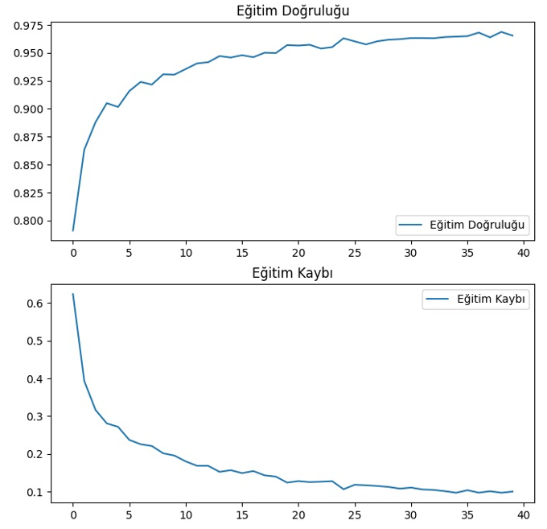

# 🍅 Tomato Leaf Disease Detection with MobileNet

This project is a deep learning application that uses the MobileNet architecture to detect diseases in tomato leaves. The model is trained to identify multiple diseases with high accuracy, making it a valuable tool for farmers.

---
## 📂 Dataset Examples
Here are some sample images from the dataset used to train the model:

## 📊 Model Architecture
The MobileNet architecture was used for this project. Below is a graphical representation of the training results of model:

## 🧪 Model Test Results
The following metrics showcase the model's performance during testing:

- **Precision**: 93.3%
- **Recall**: 93.7%
- **F1-Score**: 93.1%

## 🔍 Prediction Example
Below is an example of the model's prediction on a diseased tomato leaf:

## 🔗 Links
- [MobileNet Paper](https://arxiv.org/abs/1704.04861)
- [GitHub Repository](https://github.com/ferdiYilmaz41/tomato-disease-detection-model)

## 📜 License
This project is licensed under the MIT License. 

